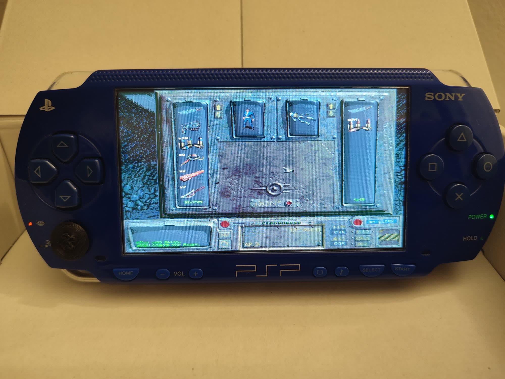
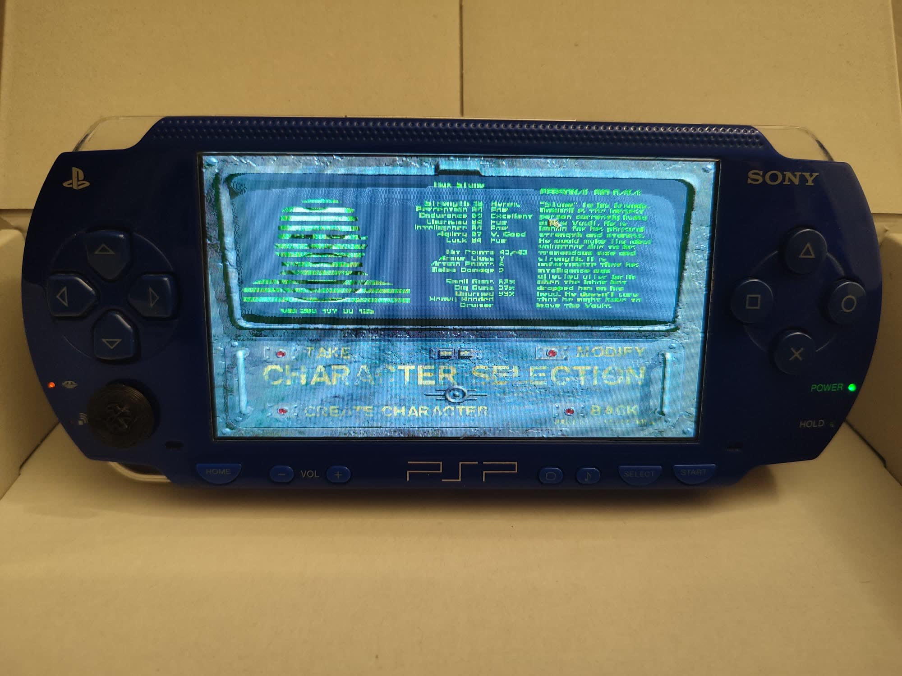
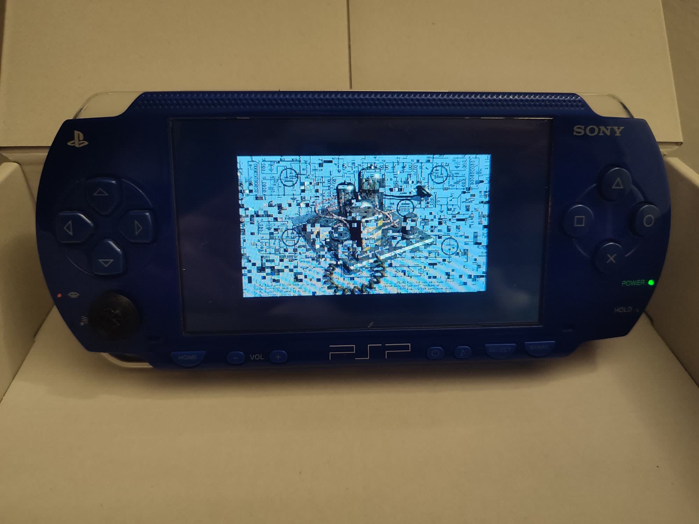
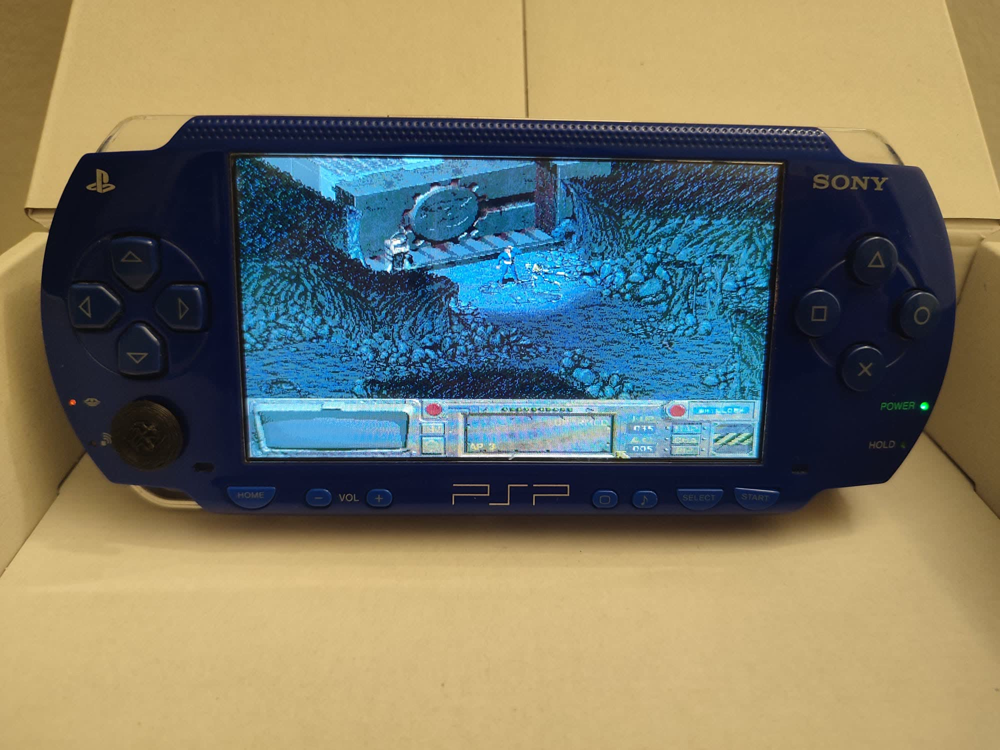

# Fallout Community Edition — PSP

A PSP port of [Fallout Community Edition](https://github.com/alexbatalov/fallout1-ce), a from-scratch reimplementation of Fallout 1.

## Status

The game is fully playable. Current known issues:

- Cutscenes and some static images have broken textures (misplaced or partially cut off)
- FPS averages 10-20
- Performance is limited by disc speed and RAM — heavier areas may cause slowdowns or crashes

## Installation

You must own the game to play. Purchase your copy on [GOG](https://www.gog.com/game/fallout) or [Steam](https://store.steampowered.com/app/38400).

1. Download `EBOOT.PBP` from the [latest release](https://github.com/abduznik/fallout1-ce-psp/releases) or build from source.

2. Connect your PSP via USB (or use a Memory Stick card reader). Create the folder `PSP/GAME/FOUT00002/` on the Memory Stick root.

3. Copy `EBOOT.PBP`, `MASTER.DAT`, `CRITTER.DAT`, and the `data` folder into `PSP/GAME/FOUT00002/`.

4. Disconnect the PSP. On the XMB, navigate to **Game → Memory Stick** and launch **Fallout CE**.

Debug logs are written to `psp_debug.txt` on the Memory Stick root.

## Screenshots

| Inventory | Character Sheet |
|-----------|-----------------|
|  |  |

| Cutscene | Gameplay |
|----------|----------|
|  |  |

## Building from source

Install [pspdev](https://github.com/pspdev/pspdev), then:

```bash
source /opt/pspdev/psp/share/pspdevenv.sh
cmake -B build -DCMAKE_BUILD_TYPE=Release
cmake --build build -j $(nproc)
```

The build produces `EBOOT.PBP` in the `build/` directory.

## License

The source code in this repository is available under the [Sustainable Use License](LICENSE.md).
